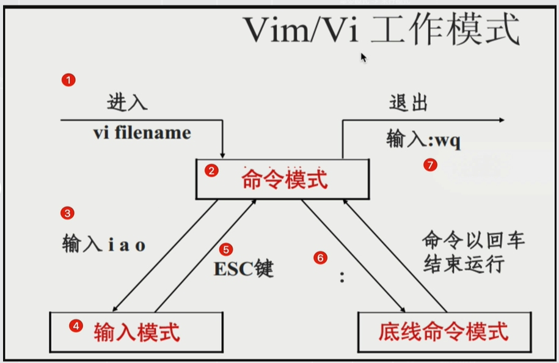

+++
title = 'Linux系统教程'
date = 2023-11-25T11:29:37+08:00
draft = true
toc = true
tags = ["linux"]
+++

<!-- [toc] -->

## 文章目的

希望linux初学者可以通过本章内容，快速入门linux。文章引用了菜鸟教程的优秀文章，以及网络上的一些图片

## linux的必要性

linux是一个稳定， 安全， 开源，免费的操作系统内核。 支持多用户同时使用。成为了各大公司服务器的首选。

掌握Linux可以提高技术就业竞争力。许多IT岗位将熟练使用Linux作为必备技能。

## 基于linux内核的主流发行版

| 系统分类 | 特点 | 软件安装工具 |
| :----: | :----: | :----: |
|ubuntu  | 自带桌面 | apt |
|manjaro  |  | apt |
|centos  |  | yum |

## 初级阶段

### 终端，shell 和 命令

终端：一个供用户输入的黑框

shell：一个命令解释器，它不仅仅是提供了**命令解释**的功能，还**允许用户编写脚本**，将多个命令组合在一起以完成更复杂的任务。

用户与Linux系统交互的基本原理：用户使用终端（Terminal）通过**命令或脚本**与Shell进行通信， shell与操作系统进行通信

常见的linux shell包括： bash(默认shell), zsh, fish, csh, dash

bash的配置文件： ~/.bashrc

加载配置文件的配置到当前bash： source ~/.bashrc

命令：操作系统中提供的工具（可执行文件），供用户使用。

命令学习手册： man 命令。 可以查看命令的作用和相关参数

命令的优势

- 相比于图形界面GUI，命令可以更方便的通过脚本，自动化执行一系列的操作
- 输入命令，完成各种操作，比图形界面GUI更高效

### ssh

ssh是一种**安全的网络协议**。 可以安全的远程连接电脑。

远程连接的意义

- 方便随时随地的查看状态，处理故障
- 可以远程连接多个地区的服务器，统一管理
可以看出 远程连接服务器的优势： **高效，安全**

相关命令

- ssh 用户名@服务器的IP地址

### 文件管理

linux中 一切皆文件

linux 目录结构：<https://www.runoob.com/linux/linux-system-contents.html>

文件路径分类

- 绝对路径
  - 从根目录/开始
- 相对路径
  - . 当前路径
  - .. 当前路径的上级路径

相关命令

- 最基本命令
  - pwd ：当前绝对路径
  - cd 路径：移动
  - ls ：查看当前文件夹内容
  - tree： 以树形结构查看当前文件夹内容
- 文件文件夹相关
  - mkdir 文件夹名： 创建文件夹
  - touch 文件名：创建文件
  - rm 文件名： 删除文件或文件夹
  - mv 文件名 移动位置： 移动文件或文件夹
  - cp  文件名 新文件名：复制文件或文件夹
  - cat 文件名：查看文件
  - tail 文件名：查看文件末尾
  - find -name 文件名： 查找

- 打包和压缩
  - 不同文件后缀的含义
    - .tar： 打包文件
    - .tar.gz： 压缩包文件， 大小约为打包文件的1/7
  - 命令
    - tar

### 文件权限

查看权限 ls -l

[Linux 文件基本属性 | 菜鸟教程 (runoob.com)](https://www.runoob.com/linux/linux-file-attr-permission.html)

权限分类

- r 4 读权限(read)
- w 2 写权限(write)
- x 1 执行权限(execute)

常用权限

- 755： 自己可读可写可执行，用户组和其他人可读可执行，不可写
- 700： 自己可读可写可执行，用户组和其他人没有任何权限

相关命令

- chmod 修改文件权限
- chgrp 修改文件属组
- chown 修改文件属主

### vi/vim 编辑

配置文件 ~/.vimrc

三种模式

- 命令模式
  - 操作
    - 查找： / 关键字 ， 之后按n找下一个匹配， 按N找上一个匹配
- 编辑模式
  - 进入方式
    - a 增加的方式进入编辑模式
    - i 插入的方式进入编辑模式
    - o 另起一行的方式进入编辑模式
  - 退出方式
    - esc
- 末行模式
  - 进入方式
    - : 进入末行模式
  - 退出方式
    - enter 退出末行模式
  - 操作
    - 退出保存 wq
    - 退出不保存 q!
    - 

### 磁盘管理

相关命令

- du -sh 文件名 ：查看各文件大小
- df -h ：检查磁盘空间占用情况

## 中级阶段

### 进程管理

相关概念

- 进程：操作系统进行资源分配的基本单位
- 线程：进程中最小的执行单位
- 协程：用户态线程

进程分类

- 孤儿进程
- 僵尸进程

后台运行： nohup 命令&

相关命令

- top ：查看进程，内存，交换空间等， 相当于windows 的 任务管理器
- htop：top的彩色加强版， 需要安装
- glances: top的彩色加强版plus，需要安装
- ps ：查看进程
- kill -9 pid：杀死进程

### 软件安装

如果下载很慢的话，需要**切换下载源**

相关命令

- ubuntu
  - sudo apt update && sudo apt upgrade : 更新
  - sudo apt install xxx : 下载
  - sudo apt remove xxx : 卸载
  
- centos
  - yum update : 更新
  - yum install xxx : 下载
  - yum remove xxx : 卸载
  

## 高级阶段

### 用户管理

linux系统支持**多用户同时使用**。可以为每个用户设置群组， 通过群组间接进行权限控制

超级用户 root, 拥有最高权限

普通用户, 拥有有限的权限

sudo命令 提升权限 visudo

文件信息

- /etc/passwd 用户的信息文件
- /etc/group 用户组的信息文件

相关命令

- groupadd
- groupmod
- groupdel
- useradd
- usermod
- userdel

### 网络管理

常用命令

- ifconfig
- ping
- curl

### 防火墙

常用命令

- iptables

### shell脚本

概念： 在文件中，按照语法规则，编写一系列的能够被shell解释的**shell命令**，供操作系统执行， 这个文件就是shell脚本。 通常命名为*.sh

shell脚本的优势：

- **自动化执行一系列操作**，无需手动一个一个命令的执行
- 可以设置定时执行
- 学习难度不大

主要学习内容：

- 编写范式
- test
  - fdf
  - 反对法地方
    - fdfd
    - 反对反对
      - 广泛广泛

- 判断
- 条件
- 循环
- 函数
- debug
